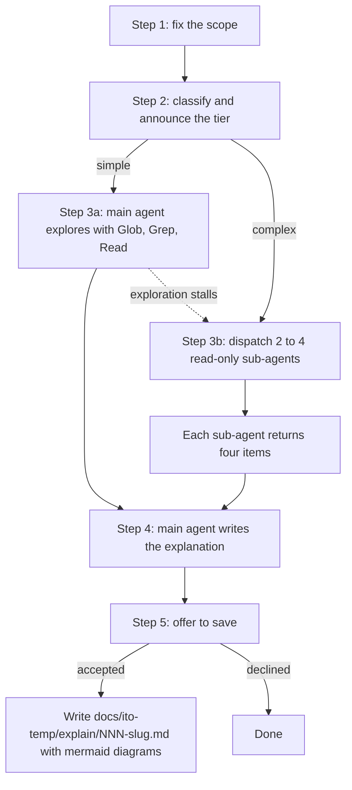

# Handoff: design review of the `ito-explain` skill

## What you are asked to do

Review the design of `.claude/skills/ito-explain/SKILL.md` for internal logical consistency.

Answer two questions:

1. Is the design internally coherent? Every step's inputs must be produced by an earlier step, every branch must have an exit, and every completion criterion must be satisfiable by the actions its own step defines.
2. Does any instruction contradict another instruction, its own completion criterion, the front matter, or `agents/openai.yaml`?

Read the two files in full before judging. Report contradictions with the line numbers of both sides of each contradiction.

## Scope of the review

In scope: logical consistency of the design.

Out of scope, because each was decided by the user and is not open for re-litigation:

- Dropping critique mode.
- The main agent synthesizing instead of a synthesizer sub-agent.
- The absence of a `references/` directory.
- The `docs/ito-temp/explain/` destination and the three-digit numbering.
- The exact `description` and `argument-hint` wording.
- Leaving the sub-agent type and model unnamed.

If one of these creates a genuine logical contradiction, report the contradiction. Do not report it as a preference.

## Files under review

- `.claude/skills/ito-explain/SKILL.md`
- `.claude/skills/ito-explain/agents/openai.yaml`

## Origin

The skill is a derivative of `skills/how` from `https://github.com/poteto/how`, with critique mode removed and the workflow adapted to this repository's conventions. The original has two modes, Explain and Critique. Only Explain was carried over.

Changes from the original, all deliberate:

| Original | Here | Reason |
|---|---|---|
| Critique mode with three model-specific critics | Removed | The user does not want it. |
| A synthesizer sub-agent merges explorer findings | The main agent synthesizes | One fewer hop, and the main agent already holds the conversation. |
| The simple tier spawns one explainer sub-agent | The simple tier runs in the main agent | A narrow question does not survive the compression of a sub-agent report. |
| Explorer and explainer prompts in `references/*.md` | Each sub-agent's goal stated inline in `SKILL.md` | The user wants no prompt files. |
| `subagent_type: generalPurpose`, `model: gpt-5.4`, `readonly: true` | "read-only exploration sub-agents", no type, no model | Those values are Cursor-specific. Naming a type or model binds the skill to one harness. |
| Explanation printed only | Printed, then offered for saving | The user wants a copy for pasting into a PR or a document. |
| No diagrams | ASCII in chat, mermaid in the saved file | The user asked for diagrams. Terminals render ASCII, files render mermaid. |

## The design, decision by decision

Each row is a decision the user settled during a grilling session.

| # | Decision | Chosen | Rejected alternatives |
|---|---|---|---|
| 1 | Name | `ito-explain` | `ito-how`, `ito-architecture` |
| 2 | Two tiers or one | Keep both the simple and complex tiers, drop the synthesizer | Single agent only, always multi-agent |
| 3 | Prompt files | None. Each sub-agent's goal is stated in `SKILL.md` | `references/explorer-prompt.md` and `references/explainer-prompt.md` |
| 4 | Output destination | Always print, then offer to save under `docs/ito-temp/explain/` | Print only, always write a file |
| 5 | Invocation | `disable-model-invocation: true`, user invokes with `/ito-explain` | Model-invoked |
| 6 | Relation to `ito-search` | None. Codebase only. State the boundary when the answer lies outside | Suggest `ito-search`, call it automatically |
| 7 | Who picks the tier | The agent picks and announces the choice before exploring | Agent decides silently, user passes a flag |
| 8 | Simple tier mechanics | Main agent explores directly | Spawn one explorer and synthesize its report |
| 9 | Sub-agent type and model | Unnamed, described by property: read-only exploration sub-agents | Bind to a named agent type, pin a model |
| 10 | Explorer count | 2 to 4, one distinct slice each | A tiered budget table, no upper bound |
| 11 | Output sections | Overview, Key Concepts, How It Works, Where Things Live, Gotchas, each omitted when the question does not need it | Fewer sections, all sections mandatory |
| 12 | Saved file name | `NNN-<slug>.md`, highest existing number plus one, from `001` | `<slug>.md`, `<date>-<slug>.md`, ask the user |
| 13 | Explanation language | Match the conversation | Always English, always Chinese |
| 14 | Slug language | English kebab-case always | Match the explanation language |
| 15 | `.gitignore` for `docs/ito-temp/` | Not touched this round | Add an ignore rule, commit the saved files |
| 16 | Sub-agent report shape | Exactly four items: components found, flow traced, paths read, anything surprising | Free form, a full draft per explorer |
| 17 | When to draw a diagram | The agent judges whether the diagram beats the surrounding prose | Mandatory on any multi-step flow, at least one per explanation |
| 18 | Diagram form when saved | Rewrite each ASCII diagram as mermaid. The file carries mermaid alone | Keep both forms, use mermaid everywhere |

## Intended control flow

## Known tensions worth checking

These are the places where a contradiction is most likely. Judge each one.

1. **Step 3's method bullets apply to both tiers**, but the four-item report contract in the same step applies only to sub-agents. The main agent on the simple tier has no report to produce. Confirm that this reads unambiguously.
2. **Step 2 allows escalation from simple to complex** when direct exploration stalls, but the escalation happens during Step 3. Confirm that the instruction sits in a step that can act on it.
3. **Step 4's completion criterion refers back to the scope stated in Step 1.** Confirm the scope is stated in a form Step 4 can check against.
4. **Step 4 says "match the conversation language" and Step 5 forces an English slug.** Confirm the two coexist without ambiguity.
5. **Step 1 requires reading every governing `CLAUDE.md` and `AGENTS.md`.** Confirm the criterion is satisfiable when none exist.
6. **The front matter sets `disable-model-invocation: true` and `agents/openai.yaml` sets `allow_implicit_invocation: false`.** These are the same decision in two files with opposite polarity. Confirm they agree.

## Review history already performed

A fresh-eyes pruning pass ran three rounds against `.claude/skills/ito-write-agent-docs/references/WRITING-PRINCIPLES.md`. It covered no-op sentences, duplication, stale caches, weak context pointers, negation, em dashes, and semicolons, and it ended with no remaining defects on those axes.

That pass did not review the design for logical consistency, which is why this review exists. Do not repeat the prose-level pruning.

Three of its verdicts were rejected on the user's authority: the `description` wording, the three-digit numbering, and leaving the sub-agent type unnamed.
